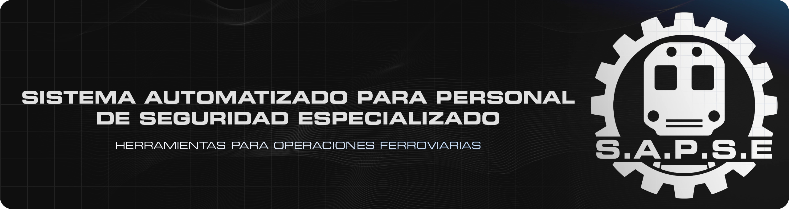

<!-- 00- Nombre -->

  

  <!-- 01- Lenguajes y Herramientas -->

<!-- 02- Badges de contacto -->
<!-- "(https://img.shields.io/badge/[texto_a_mostrar]-181818?style=for-the-badge&logo=[nombre_de_simpleicons.org]&logoColor=[color_logo]&labelColor=[color_fondo_logo]&color=[color_fondo_text]" -->

  
  

  

  

  
  

<!-- 03- Animacion -->

  

  
<!-- 04- Información -->

  
  

---

<!-- 05- Enfoque actual -->

 
  
<h2>ENFOQUE ACTUAL</h2>

  

  

  

| MÓDULO              | DESCRIPCIÓN                                                                                                                | INTEGRACIÓN CON SAP-Control         | PLATAFORMA                                            |
| ------------------- | -------------------------------------------------------------------------------------------------------------------------- | ----------------------------------- | ----------------------------------------------------- |
| **Astra**           | Núcleo central de monitoreo y control inteligente, responsable de la supervisión y coordinación del sistema.               | <ul><li>[x] Sí</li></ul>            | Windows (gestionable mediante comandos desde Android) |
| **SAP-Control**     | Suite de herramientas orientadas a la administración, gestión y control integral del sistema, recursos y tareas laborales. | <ul><li>[x] Sí</li></ul>            | Windows y Android                                     |
| **R.G Profesional** | Report Generator: herramienta avanzada para la generación automática e inteligente de reportes.                            | <ul><li>[x] Sí</li></ul>            | Windows y Android                                     |
| **Bio-Search**      | Herramienta de búsqueda y análisis de registros biométricos laborales, enfocado en filtrado, control y seguimiento diario. | <ul><li>[x] Sí</li></ul>            | Windows y Android                                     |
| **Optimizer**       | Herramienta de optimización automatizada de dispositivos laborales.                                                        | <ul><li>[x] Sí</li></ul>            | Windows                                               |
| **SAP-Track**       | Sistema de seguimiento GPS para dispositivos móviles en tiempo real.                                                       | <ul><li>[x] Sí</li></ul>            | Android                                               |

---

<!-- 06- Repositorios Principales -->

 
  
<h2>REPOSITORIOS PRINCIPALES</h2>

  

    
    
    
    
    
    
  

  

    
  

---

<!-- 07- Repositorios Principales -->

 
  
<h2>REPOSITORIOS QUE RECOMIENDO</h2>

  

    
    
    
     
  

  

---

<!-- 08- Estadisticas -->

  

  

